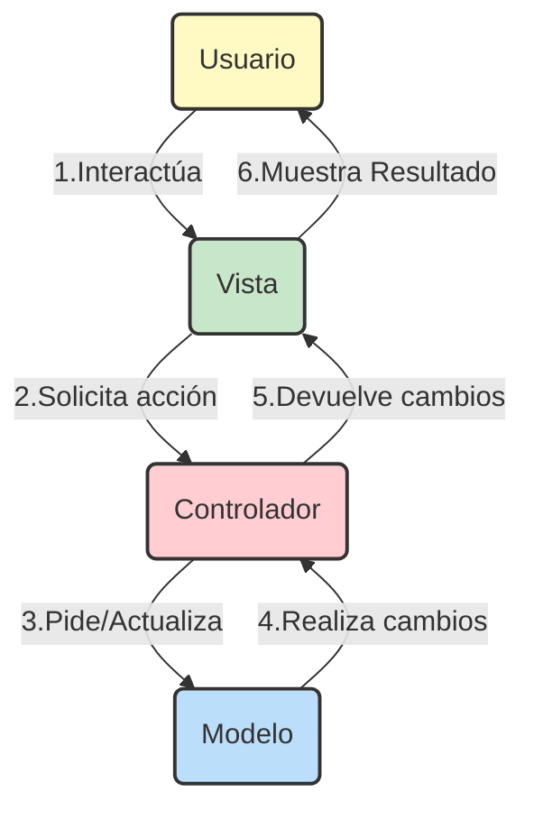
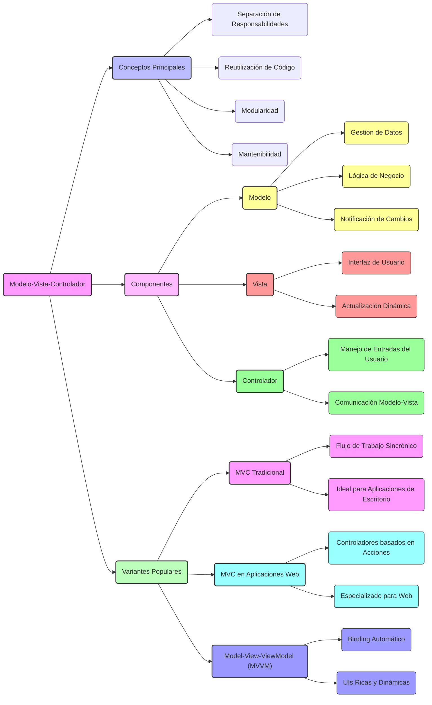

URL: https://github.com/javierfausgmail/PRG/blob/main/POO%20y%20UML/MVC.md
## Índice

1. **Introducción a MVC** (5 minutos)
   - Breve historia y origen de MVC.
   - Explicación general del patrón MVC.
   - Importancia y aplicabilidad en el desarrollo de aplicaciones multiplataforma.

2. **Componentes del MVC** (10 minutos)
   - **Modelo**: Definición y responsabilidades.
   - **Vista**: Definición y responsabilidades.
   - **Controlador**: Definición y responsabilidades.
   - Diagrama que relacione estos componentes.

3. **Versiones Populares de MVC** (10 minutos)
   - MVC Tradicional: Características y aplicación.
   - MVC Aplicado en Aplicaciones Web (MVC 2): Diferencias con el tradicional, características.
   - MVVM (Model-View-ViewModel): Como varía del MVC, y en qué casos es preferido.

4. **Resumen: Mapa Mental**

5. **Ejemplo Práctico en Java** (10 minutos)
   - Presentación de un caso de uso simple (por ejemplo, una aplicación de consola de texto de gestión de una lista de tareas).
   - Implementación paso a paso de cada componente MVC en Java. 

6. **Preguntas de Comprobación de Conocimientos** (5 minutos)
   - Preguntas de opción múltiple o verdadero/falso para evaluar la comprensión de los conceptos.
   - Un ejercicio breve donde los alumnos identifiquen los componentes MVC en un fragmento de código dado.

7. **Recursos Adicionales y Recomendaciones** (5 minutos)
   - Enlaces a tutoriales o cursos en línea para profundizar en MVC y MVVM.
   - Sugerencia de un video de YouTube que ejemplifique la implementación de MVC en Java.


## 1. Introducción al MVC

#### Breve Historia y Origen del MVC

El patrón de diseño Modelo-Vista-Controlador (MVC) fue introducido por primera vez en la década de 1970 por Trygve Reenskaug, quien trabajaba en Smalltalk en Xerox PARC. Este patrón fue ideado para resolver el problema de la separación de la lógica de negocio de la interfaz de usuario en las aplicaciones de software, facilitando así el desarrollo, la prueba y el mantenimiento de aplicaciones complejas.

#### Explicación General del Patrón MVC

El patrón MVC es una metodología de diseño que divide una aplicación en tres componentes interconectados, cada uno con responsabilidades específicas:

- **Modelo**: Es el componente central del patrón, responsable de la gestión de los datos y la lógica de negocio. El modelo se comunica con la base de datos y define las reglas para acceder o modificar los datos.
- **Vista**: Presenta los datos al usuario de una manera comprensible. La vista obtiene su información del modelo y la muestra al usuario sin incluir lógica de procesamiento de negocio, lo que significa que simplemente representa la información en un formato específico.
- **Controlador**: Actúa como un intermediario entre la vista y el modelo. Responde a las entradas del usuario, invocando cambios en el modelo y/o en la vista.

Estos tres componentes trabajan conjuntamente para permitir una clara separación entre la presentación de la información y la forma en que se recopila y manipula la información (lógica de negocio), facilitando el desarrollo modular de la aplicación.

#### Importancia y Aplicabilidad en el Desarrollo de Aplicaciones Multiplataforma

La importancia del MVC radica en su capacidad para proporcionar una estructura organizada que no solo ayuda en el desarrollo de aplicaciones robustas y escalables, sino que también facilita el trabajo en equipo, ya que diferentes desarrolladores pueden trabajar simultáneamente en distintos componentes sin interferir unos con otros.

Su aplicabilidad en el desarrollo de aplicaciones multiplataforma es notable, ya que permite reutilizar la lógica de negocio (modelo) en diferentes plataformas mientras se diseñan vistas específicas para cada una, optimizando así el desarrollo de aplicaciones web, móviles y de escritorio. Además, el uso de MVC en aplicaciones multiplataforma ayuda a mantener la coherencia de los datos y la funcionalidad a través de las plataformas, facilitando las actualizaciones y el mantenimiento.

En resumen, MVC no es solo un patrón de diseño; es una estrategia esencial para el desarrollo moderno de software que promueve la eficiencia, la modularidad y la escalabilidad.

## 2. Componentes del MVC

El patrón Modelo-Vista-Controlador (MVC) es fundamental para el diseño y desarrollo de software, particularmente en aplicaciones web. Este enfoque estructura una aplicación en tres componentes principales, cada uno con responsabilidades claras y definidas, facilitando así la mantenibilidad, escalabilidad y la capacidad de prueba del software. A continuación, se detalla cada componente y sus responsabilidades.

#### Modelo

**Definición**: El Modelo representa la parte de la aplicación que maneja la lógica para el dominio de datos del negocio. Es el componente central que gestiona los datos, las reglas de negocio y las funciones.

**Responsabilidades**:
- **Gestión de Datos**: Encargado de almacenar, recuperar y actualizar datos en la base de datos.
- **Reglas de Negocio**: Define las reglas de negocio (por ejemplo, cálculos, condiciones, operaciones de datos) necesarias para manipular los datos.
- **Notificación de Cambios**: Informa a la vista de los cambios en los datos para que pueda actualizar la presentación si es necesario.

#### Vista

**Definición**: La Vista es el componente que se encarga de presentar los datos al usuario. Es la representación visual de los datos que el modelo contiene.

**Responsabilidades**:
- **Presentación de Datos**: Muestra los datos al usuario de una manera entendible.
- **Interactividad**: Gestiona la interactividad con el usuario, capturando las acciones del usuario e indicando al controlador la acción a realizar.
- **Actualización de la Interfaz**: Se actualiza en respuesta a los cambios en el modelo, asegurando que el usuario siempre vea la presentación más actual de los datos.

#### Controlador

**Definición**: El Controlador actúa como el intermediario entre el Modelo y la Vista. Procesa todas las solicitudes del usuario, manipula el modelo y decide la vista con la que responder.

**Responsabilidades**:
- **Procesamiento de Solicitudes**: Recibe las entradas del usuario a través de la vista, procesándolas para determinar la acción requerida.
- **Manipulación del Modelo**: Puede ordenar al modelo que cambie su estado (por ejemplo, editar un dato).
- **Selección de Vista**: Determina cuál vista se debe mostrar al usuario en respuesta a las diferentes acciones o entradas del usuario.

#### Diagrama que Relacione estos Componentes

A continuación, se presenta un diagrama simplificado que muestra cómo interactúan el Modelo, la Vista y el Controlador en el patrón MVC. Este diagrama ilustra el flujo de datos y control entre los componentes, proporcionando una visión clara de la estructura MVC.




Este diagrama refleja lo siguiente:

1. **Interacción inicial del usuario**: El usuario interactúa con la aplicación a través de la Vista, ya sea mediante la selección de opciones en una interfaz de consola o a través de entradas en una GUI.
2. **Solicitudes de acción**: La Vista envía las solicitudes de acción del usuario al Controlador.
3. **Procesamiento y actualización**: El Controlador procesa estas solicitudes, posiblemente actualizando el Modelo en respuesta a las acciones del usuario.
4. **Notificación de cambios**: Aunque en un entorno de consola este paso es más una actualización dirigida por el Controlador que una notificación automática, conceptualmente el Modelo informa de los cambios, permitiendo que la Vista se actualice con la información más reciente.
5. **Actualización de la Vista**: El Controlador instruye a la Vista para que se actualice, reflejando cualquier cambio en el Modelo.
6. **Visualización al usuario**: Finalmente, la Vista muestra los datos actualizados o el resultado de las acciones del usuario.

Este flujo destaca la separación de responsabilidades dentro del patrón MVC, facilitando un desarrollo modular y fácil de mantener para aplicaciones.

## 3. Versiones Populares de MVC

El patrón Modelo-Vista-Controlador (MVC) ha evolucionado desde su concepción inicial para adaptarse a distintas plataformas y necesidades de desarrollo. A lo largo del tiempo, han surgido variantes que mantienen la esencia del MVC original, pero con ajustes en su estructura y funcionamiento. Las versiones más populares incluyen el MVC Tradicional, el MVC Aplicado en Aplicaciones Web (a menudo referido como MVC 2), y el Model-View-ViewModel (MVVM). A continuación, se exploran estas versiones destacadas.

#### MVC Tradicional

**Características y Aplicación**:
- **Separación de Responsabilidades**: El MVC Tradicional establece una clara división entre la lógica de negocio (Modelo), la interfaz de usuario (Vista) y la intermediación entre ambos (Controlador).
- **Flujo de Trabajo Sincrónico**: En aplicaciones de escritorio o sistemas donde la interacción es directa y lineal, el MVC tradicional gestiona el flujo de trabajo de manera efectiva, respondiendo a eventos de usuario de forma sincrónica.
- **Aplicación**: Predominantemente utilizado en aplicaciones de escritorio y sistemas donde las actualizaciones de la vista pueden gestionarse de manera directa a través del controlador.

#### MVC Aplicado en Aplicaciones Web (MVC 2)

**Diferencias con el Tradicional**:
- **Flujo de Trabajo Asincrónico**: Considerando la naturaleza de las aplicaciones web, que requieren comunicación entre el cliente y el servidor, el MVC en este contexto adapta su flujo para manejar solicitudes HTTP de forma asincrónica.
- **Controladores Orientados a Acciones**: Los controladores en MVC 2 suelen estar diseñados para manejar acciones específicas, cada una correspondiente a una solicitud HTTP diferente, como GET o POST.

**Características**:
- **Soporte para Tecnologías Web**: Incluye soporte integrado para tecnologías web, como AJAX, que permite actualizar la vista sin recargar la página completa.
- **Framework de Aplicación**: Muchos frameworks de desarrollo web, como ASP.NET MVC, Spring MVC y Ruby on Rails, implementan esta variante, proporcionando estructuras y herramientas específicas para facilitar el desarrollo web siguiendo el patrón MVC.

#### Model-View-ViewModel (MVVM)

**Como Varía del MVC**:
- **ViewModel**: Introduce el componente ViewModel, que actúa como un abstracción del Modelo que prepara los datos para que la Vista los muestre, además de manejar la lógica de presentación. A diferencia del Controlador en MVC, el ViewModel en MVVM facilita un enlace bidireccional (binding) entre la Vista y el Modelo, permitiendo actualizaciones automáticas entre la vista y los datos.
- **Mayor Enfoque en la Separación**: Aunque tanto MVC como MVVM promueven la separación de la lógica de negocio de la interfaz de usuario, MVVM permite una mayor desacoplamiento, especialmente útil en aplicaciones ricas en interacciones y complejas en términos de lógica de presentación.

**En qué Casos es Preferido**:
- **Aplicaciones Ricas en Interfaz de Usuario**: MVVM es especialmente valorado en el desarrollo de aplicaciones con interfaces de usuario ricas y dinámicas, como las aplicaciones de Windows Presentation Foundation (WPF), Xamarin.Forms o aplicaciones web modernas que utilizan frameworks como Angular o React.
- **Desarrollo de Front-end**: Por su capacidad para simplificar el manejo de eventos y las actualizaciones de la UI de forma reactiva, MVVM es preferido en escenarios donde la separación entre el diseño de la UI y la lógica de negocio debe ser máxima, facilitando la colaboración entre diseñadores y desarrolladores.

Cada una de estas variantes del MVC responde a necesidades específicas del desarrollo de software, adaptándose a distintos entornos y tecnologías para maximizar la eficiencia del diseño y la implementación de aplicaciones. La elección entre estas depende de varios factores, incluyendo el tipo de aplicación, el entorno de desarrollo, las preferencias del equipo y los requisitos específicos del proyecto.


## 4. Resumen: Mapa mental



## 5. Ejemplo Práctico en Java: Aplicación de Consola de Texto para Gestión de una Lista de Tareas

En este ejemplo, desarrollaremos una aplicación de consola de texto simple en Java que permite a los usuarios gestionar una lista de tareas. El usuario podrá añadir, eliminar y ver tareas. Implementaremos este ejemplo utilizando el patrón de diseño MVC.

#### Caso de Uso Simple

La aplicación debe permitir al usuario realizar tres acciones principales:
1. **Añadir una nueva tarea**: El usuario puede añadir una nueva tarea a la lista.
2. **Eliminar una tarea**: El usuario puede eliminar una tarea existente de la lista.
3. **Ver todas las tareas**: El usuario puede ver la lista de todas las tareas pendientes.

#### Estructura del Proyecto

El proyecto se divide en tres componentes principales siguiendo el patrón MVC:

- **Modelo (`TaskModel`)**: Representa la estructura de datos de una tarea y gestiona la lista de tareas (para simplificar, una tarea será simplemente un objeto de tipo String).
- **Vista (`TaskView`)**: Presenta la interfaz de usuario en la consola y muestra información al usuario.
- **Controlador (`TaskController`)**: Actúa como intermediario entre el modelo y la vista, procesando las entradas del usuario y actualizando la vista y el modelo.

#### Implementación Paso a Paso

##### Modelo: `TaskModel.java`

El modelo gestiona la lista de tareas. Aquí, simplemente usaremos un `ArrayList<String>` para almacenar las tareas.

```java
import java.util.ArrayList;
import java.util.List;

public class TaskModel {
    private List<String> tasks;

    public TaskModel() {
        this.tasks = new ArrayList<>();
    }

    public void addTask(String task) {
        tasks.add(task);
    }

    public boolean removeTask(int index) {
        if (index >= 0 && index < tasks.size()) {
            tasks.remove(index);
            return true;
        }
        return false;
    }

    public List<String> getTasks() {
        return tasks;
    }
}
```

##### Vista: `TaskView.java`

La vista muestra la interfaz de usuario en la consola. Para simplificar, incluiremos métodos para mostrar tareas y mensajes al usuario.

```java
import java.util.List;

public class TaskView {
    public void showTasks(List<String> tasks) {
        if (tasks.isEmpty()) {
            System.out.println("No hay tareas pendientes.");
        } else {
            System.out.println("Tareas Pendientes:");
            for (int i = 0; i < tasks.size(); i++) {
                System.out.println((i + 1) + ". " + tasks.get(i));
            }
        }
    }

    public void showMessage(String message) {
        System.out.println(message);
    }
}
```

##### Controlador: `TaskController.java`

El controlador maneja la lógica de interacción, recibiendo entradas del usuario y actualizando el modelo y la vista según corresponda.

```java
import java.util.Scanner;

public class TaskController {
    private TaskModel model;
    private TaskView view;

    public TaskController(TaskModel model, TaskView view) {
        this.model = model;
        this.view = view;
    }

    public void startApplication() {
        Scanner scanner = new Scanner(System.in);
        String input;
        boolean running = true;

        while (running) {
            view.showMessage("Opciones: (1) Ver Tareas (2) Añadir Tarea (3) Eliminar Tarea (4) Salir");
            input = scanner.nextLine();

            switch (input) {
                case "1":
                    view.showTasks(model.getTasks());
                    break;
                case "2":
                    view.showMessage("Introduce la nueva tarea:");
                    input = scanner.nextLine();
                    model.addTask(input);
                    view.showMessage("Tarea añadida.");
                    break;
                case "3":
                    view.showMessage("Introduce el número de la tarea a eliminar:");
                    input = scanner.nextLine();
                    int index = Integer.parseInt(input) - 1;
                    if (model.removeTask(index)) {
                        view.showMessage("Tarea eliminada.");
                    } else {
                        view.showMessage("Error: Tarea no encontrada.");
                    }
                    break;
                case "4":
                    running = false;
                    view.showMessage("Aplicación finalizada.");
                    break;
                default:
                    view.showMessage("Opción no válida.");
                    break;
            }
        }

        scanner.close();
    }
}
```

##### Ejecución de la Aplicación

Para completar el ejemplo, necesitamos una clase `Main` que instancie el modelo, la vista y el controlador, y comience la ejecución de la aplicación:

```java
public class Main {
    public static void main(String[] args) {
        TaskModel model = new TaskModel();
        TaskView view = new TaskView();
        TaskController controller = new TaskController(model, view);
        
        controller.startApplication();
    }
}
```

Este código establece la conexión entre los componentes MVC y pone en marcha el ciclo de interacción de la aplicación. A través de este ejemplo, los estudiantes pueden observar cómo el patrón MVC facilita la organización del código, promoviendo una estructura clara y modular que separa la lógica de negocio de la interfaz de usuario y la lógica de control.

## 6. Preguntas de Comprobación de Conocimientos

Para evaluar la comprensión de los conceptos del patrón Modelo-Vista-Controlador (MVC) presentados en esta lección, se proponen las siguientes preguntas de opción múltiple y de verdadero/falso, junto con un ejercicio breve.

#### Preguntas de Opción Múltiple

1. ¿Cuál es la responsabilidad principal del componente Modelo en el patrón MVC?
   - A) Actualizar la interfaz de usuario.
   - B) Gestionar la lógica de negocio y los datos de la aplicación.
   - C) Manejar las interacciones del usuario.

<details>
<summary>Mostrar respuesta correcta</summary>
B
</details>

2. En el patrón MVC, ¿qué componente se encarga de recibir las acciones del usuario y actualizar la vista y el modelo adecuadamente?
   - A) Modelo
   - B) Vista
   - C) Controlador


<details>
<summary>Mostrar respuesta correcta</summary>
C
</details>


3. ¿Qué característica describe mejor al ViewModel en el patrón MVVM comparado con el Controlador en el patrón MVC?
   - A) El ViewModel permite un enlace bidireccional automático entre la vista y los datos del modelo.
   - B) El ViewModel elimina la necesidad de un modelo.
   - C) El ViewModel gestiona directamente las solicitudes del usuario.


<details>
<summary>Mostrar respuesta correcta</summary>
A
</details>


#### Preguntas de Verdadero/Falso

 - El patrón MVC no es adecuado para aplicaciones web modernas. 

<details>
<summary>Mostrar respuesta correcta</summary>
FALSO
</details>

- En una aplicación MVC, el Modelo puede notificar directamente al Usuario sobre los cambios en los datos.

<details>
<summary>Mostrar respuesta correcta</summary>
FALSO
</details>

-  El Controlador en el patrón MVC actúa como intermediario entre la Vista y el Modelo.

<details>
<summary>Mostrar respuesta correcta</summary>
VERDADERO
</details>

#### Ejercicio Breve

Dado el siguiente fragmento de código en Java, identifique los componentes del patrón MVC representados:

```java
public class LibroModel {
    private String titulo;
    private String autor;

    public String getTitulo() {
        return titulo;
    }

    public void setTitulo(String titulo) {
        this.titulo = titulo;
    }

    // Métodos para 'autor' omitidos por brevedad...
}

public class LibroView {
    public void printDetallesLibro(String titulo, String autor){
        System.out.println("Libro: " + titulo + ", Autor: " + autor);
    }
}

public class LibroController {
    private LibroModel modelo;
    private LibroView vista;

    public LibroController(LibroModel modelo, LibroView vista){
        this.modelo = modelo;
        this.vista = vista;
    }

    public void setLibroTitulo(String titulo){
        modelo.setTitulo(titulo);
    }

    // Más métodos de controlador omitidos por brevedad...
}
```

<details>
<summary>Mostrar respuesta correcta</summary>


**Respuesta:**

- **Modelo**: `LibroModel` representa el Modelo, ya que gestiona los datos (título y autor del libro).
- **Vista**: `LibroView` es la Vista, responsable de presentar la información al usuario.
- **Controlador**: `LibroController` actúa como el Controlador, intermediando entre el Modelo y la Vista.

</details>


## 7. Recursos Adicionales y Recomendaciones

Para aquellos interesados en profundizar sus conocimientos sobre los patrones de diseño MVC y MVVM, así como mejorar sus habilidades en la implementación de estos patrones en Java y otras tecnologías, aquí se proporcionan recursos y recomendaciones cuidadosamente seleccionados.

#### Tutoriales y Cursos en Línea

1. Proyecto Java con patrón MVC [Tutorial](https://medium.com/@maheshmaddi92/6-1-model-view-controller-mvc-52e7112d5fae)

2. Proyecto JavaFX con patrón MVVM [Tutorial](https://medium.com/@maheshmaddi92/6-3-model-view-viewmodel-mvvm-45d101e25fe3)

3. **Coursera - Desarrollo de Software en Java**:
   - Un curso que cubre diversos aspectos del desarrollo de software utilizando Java, incluyendo el uso de patrones de diseño como MVC.
   - [Visitar Curso en Coursera](https://www.coursera.org/specializations/java-programming)

4. **Udemy - Java Spring Framework Masterclass**:
   - Curso completo que incluye el desarrollo de aplicaciones web en Java utilizando el Spring Framework, donde se aplica extensivamente el patrón MVC.
   - [Visitar Curso en Udemy](https://www.udemy.com/course/spring-framework-5-beginner-to-guru/)

5. **Pluralsight - Building Applications with React and Redux**:
   - Aunque se centra en React y Redux, este curso es excelente para entender los principios detrás de MVVM y cómo pueden aplicarse en el desarrollo de aplicaciones web modernas.
   - [Visitar Curso en Pluralsight](https://www.pluralsight.com/courses/react-redux-react-router-es6)

6. **Microsoft Learn - Build desktop apps with .NET and WPF**:
   - Un tutorial gratuito de Microsoft que cubre el desarrollo de aplicaciones de escritorio utilizando WPF (Windows Presentation Foundation), un escenario común para aplicar MVVM.
   - [Visitar Microsoft Learn](https://docs.microsoft.com/en-us/learn/paths/build-desktop-apps-with-dotnet-wpf/)


Nota: Debido a la naturaleza dinámica de los contenidos en línea y la posibilidad de que los enlaces cambien con el tiempo, se recomienda buscar los títulos de los recursos en las plataformas mencionadas si los enlaces directos ya no están disponibles.
